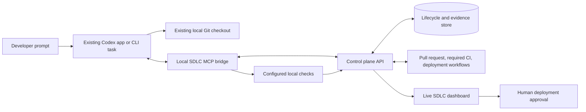

# How the native SDLC harness works

## Architecture

The current Codex conversation is the only coding agent. It keeps the repository understanding and discussion history already built with the developer. The MCP bridge is a constrained control-plane client: it records structured checkpoints, executes administrator-configured commands, and reports evidence. It cannot write repository policy, change credentials, or approve a deployment.

## Lifecycle state machine

The run starts from the current commit and records whether local modifications already exist. Codex submits structured planning, requirements, and design documents in order. Requirements with an unresolved stakeholder decision enter `needs_input`; the answer becomes part of the durable contract.

During implementation, progress events make the current activity visible in the dashboard. Verification also emits standard MCP progress notifications so a supporting Codex client can show each gate as it starts and finishes. It runs configured commands using argument arrays rather than model-generated shell strings. Setup can be reused only when dependency manifests, Node runtime, platform, and architecture match the recorded fingerprint. After setup, independent gates run with a concurrency limit of three.

The controller parses each result according to its declared format, such as Vitest, Playwright, JUnit, npm audit, pip-audit, Semgrep, or Gitleaks-compatible evidence. The bundled baseline scanners inspect tracked and new candidate source files for high-confidence credentials and dangerous execution or TLS patterns; repository policy can add stronger company scanners. The controller rejects missing commands, empty test runs, malformed reports, failed findings, timeouts, and results tied to an older policy or workspace tree.

A failed gate changes the run to `repairing`. Codex receives the concrete command output in the same conversation, fixes the checkout, and verifies again. Passing gates lead to a structured self-review against every acceptance criterion. Critical or high findings also return to repair. The verification attempt limit prevents endless loops while preserving all evidence.

Runs default to delivery mode. Codex may select validation mode only for an explicitly non-mutating audit, smoke test, or verification request. After passing gates and review, a validation run completes only when its Git tree still matches the starting tree; delivery runs continue to branch, pull request, CI, and deployment handling.

The Git tree digest is computed with a temporary Git index. This includes tracked edits, staged edits, deletions, and untracked files without changing the developer's real index. Committing identical content keeps the same tree digest, so the controller can prove that the pushed commit contains the files that passed local verification.

After Codex creates a feature branch, commits, and pushes, the control plane creates or updates a draft pull request. Required GitHub checks must pass before the PR becomes ready. If deployment is disabled, the run completes. If it is enabled, the run enters `awaiting_approval` with a digest over the immutable commit, policy version, environment, and workflow.

Only the dashboard exposes approval. An approved run dispatches the configured GitHub workflow, waits for success, checks the configured health endpoint, and dispatches rollback when the health check fails. A healthy deployment enters maintenance monitoring.

## Trust boundaries

- Codex can propose and edit code, but it cannot manufacture passing gate records.
- The model does not choose verification commands during a run; the versioned repository policy does.
- MCP calls are restricted to loopback and an explicit API allowlist.
- GitHub and deployment credentials stay in the server-side secret store and never enter MCP tool results.
- Deployment approval is unavailable to the Codex MCP tools.
- Artifacts and company context are hashed and associated with the candidate tree and policy version.

## What this implementation deliberately does not claim

A same-session review benefits from repository context and lower model usage, but it is not an independent reviewer. Companies that require separation of duties should add a second reviewer or CI-owned review gate as policy. The harness also cannot continue model reasoning after the native Codex task has closed; GitHub CI, deployment, health checks, and dashboard monitoring continue because they do not require a coding model.

Reliability ultimately depends on the configured checks. A repository with weak tests still has weak proof. Production adoption therefore requires curated policy profiles, hermetic or reproducible project environments, coverage of high-risk behavior, stable test data, and evaluation against real historical incidents.
