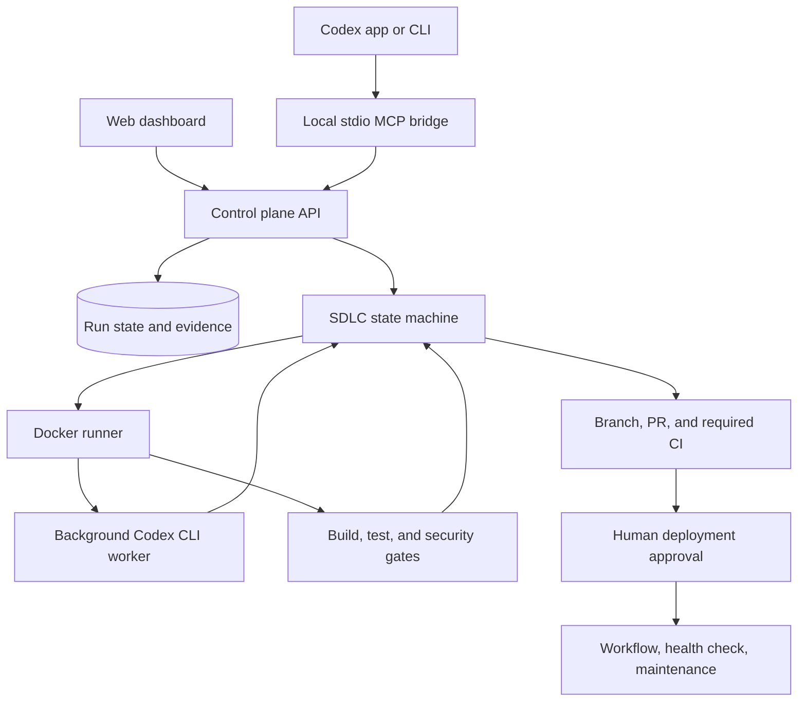

# How the SDLC Control Plane works

This document describes the implemented architecture. For installation and normal usage, start with the [README](README.md). For Codex app and CLI setup, use the [chat guide](docs/codex-chat.md).

## System flow

The application runs the real Codex CLI through `codex exec`. It does not replace Codex or call a model API directly. The control plane treats agent output as a candidate and advances only when configured evidence passes.

The foreground conversation is a control interface. A separate worker implements the task in a Docker volume cloned from the configured remote branch. Uncommitted files in the developer's local checkout are not part of the governed run.

## Components

| Component | Responsibility |
| --- | --- |
| `apps/server/src/chat-main.ts` | Starts the stdio MCP bridge and loads local configuration |
| `apps/server/src/chat-client.ts` | Authenticates to the loopback API and restricts callable paths |
| `apps/server/src/chat-mcp.ts` | Exposes run start, status, answer, cancel, resume, and report tools |
| `apps/server/src/api.ts` | Authentication, setup, repository configuration, and run API |
| `apps/server/src/engine.ts` | Durable phase transitions, repair loop, approvals, and monitoring |
| `apps/server/src/gates.ts` | Parses reports and evaluates completion evidence |
| `apps/server/src/runner-main.ts` | Owns Docker, repository operations, commands, and Codex execution |
| `apps/server/src/acceptance-files.ts` | Stages named acceptance files without shell interpolation |
| `apps/server/src/github.ts` | Pull requests, CI checks, and workflow dispatch |
| `apps/server/src/mcp.ts` | Calls administrator-approved company-context MCP tools |
| `apps/server/src/store.ts` | PostgreSQL or local PGlite persistence and run leases |

The runner is the only application component with the Docker socket. Worker containers do not receive the control-plane database or Docker socket.

## Run lifecycle

1. **Planning:** verify Docker, Codex, and GitHub; clone the configured branch; run the unchanged repository baseline; retrieve matching company context; generate scope, dependencies, effort, schedule, and risks.
2. **Requirements:** generate measurable acceptance criteria. A consequential ambiguity moves the run to `needs_input` until the user answers.
3. **Design:** generate architecture and test strategy. A separate Codex session creates acceptance tests before implementation.
4. **Coding:** give the frozen requirements, design, standards, and relevant context to a Codex worker in the isolated checkout.
5. **Testing:** commit the candidate, reject protected-path changes, run every configured check plus acceptance tests, and review the diff in another Codex session. Failures enter a bounded repair loop.
6. **Deployment:** push a branch, open a draft PR, wait for required GitHub checks, mark the PR ready, and pause at `awaiting_approval`. Approval is bound to the candidate SHA, policy version, environment, and workflow.
7. **Maintenance:** after the deployment workflow and health check pass, periodically check health. Repeated failures create an incident run that follows the same lifecycle.

The current repair budget is three attempts. Runs also have total and agent execution time limits. Resuming a run does not reset those limits.

## Evidence rules

Each run snapshots its repository policy and records the base revision, candidate revision, plan, requirements, design, context sources, gates, review, events, PR, and deployment state.

The controller rejects:

- missing, malformed, timed-out, or zero-test reports;
- required gates that fail or refer to an older candidate or policy version;
- high or critical independent-review findings;
- acceptance criteria without the required automated or human evidence;
- protected workflow or policy path changes;
- missing remote CI checks without an explicit waiver;
- deployment approval for a changed candidate.

Acceptance files use a fresh volume mounted read-only for the actual check. File names are validated and content is transferred in bounded base64 chunks without putting the content into a shell command.

## Codex conversation integration

`connect-codex.ps1` builds and registers a global `sdlc` stdio MCP server and appends a marked instruction block to the selected project's `AGENTS.md`. Re-running the installer does not duplicate that block.

The tools are:

- `sdlc_repositories`: list configured repositories and readiness;
- `sdlc_start`: register one high-level request;
- `sdlc_runs`: recover recent runs after reopening a conversation;
- `sdlc_status`: inspect state, gates, review, and evidence;
- `sdlc_answer`: submit the user's clarification answer;
- `sdlc_cancel` and `sdlc_resume`: control an existing run;
- `sdlc_report`: retrieve the evidence report.

There is deliberately no deployment-approval, policy-editing, credential, or arbitrary-command tool. Approval stays in the dashboard. Repository instructions guide tool selection but cannot intercept every prompt or prevent local edits; only registered runs have governed evidence.

The bridge accepts only numeric loopback HTTP URLs, rejects redirects, and never returns the password, session cookie, or CSRF token. It runs with the local user's filesystem permissions and is designed for one trusted local operator, not multiple tenants.

## Security boundaries

Agent and setup containers use Docker bridge networking. Ordinary verification containers use no network, a read-only root filesystem, dropped Linux capabilities, process and memory limits, and a writable named workspace volume.

This creates several practical limits:

- Networkless dependency-audit commands may need an approved advisory cache or controlled audit service. Scanner errors remain failures.
- Bridge-network traffic does not currently have domain-level allowlisting.
- The bundled Semgrep file contains only a small starter rule set.
- Docker administrators can inspect container environment values and mounts.
- Separate Codex sessions reduce shared conversational state but do not provide model-vendor independence.
- Passing generated tests and review cannot prove that the original specification is complete.

Company documents and approved MCP results guide reasoning and are recorded by version and hash. They do not change executable policy or grant tools authority.

## Deployment and demo limits

The health check verifies only that the configured URL returns a successful response. The rollback workflow is dispatched after a failed release health check, but the control plane does not prove that rollback restored a working version.

The public demo repository uses simulated deployment and rollback workflows and a GitHub repository endpoint as its health URL. It tests orchestration without releasing an application.

## Verification status

`npm run check` runs TypeScript checking, ESLint, Vitest, and production builds. Tests cover gate parsing, run leases, the engine state machine, acceptance-file staging, and MCP calls through the real local API with external systems mocked.

Dashboard E2E tests run separately with `npm run test:e2e` against a fresh development instance. A Windows stdio smoke test verifies that the built MCP bridge starts outside the repository working directory.

Automated checks do not replace a live exercise through Docker, Codex, GitHub PR/Actions, deployment approval, rollback, and process recovery. Docker was unavailable during the latest chat-integration verification, so that full path remains to be rerun.
