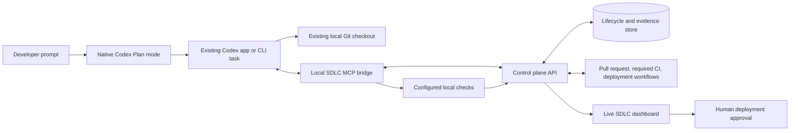

# How the native SDLC harness works

## Architecture

The current Codex conversation is the only coding agent. Native Plan mode handles repository discovery and clarification before implementation. Native `/review` later starts Codex's dedicated, read-only reviewer for the selected diff. The MCP bridge records their structured evidence, executes administrator-configured commands, and reports lifecycle state. It cannot switch Codex modes, invoke slash commands, write repository policy, change credentials, or approve a deployment.

## Lifecycle state machine

The developer starts in native Plan mode. After its initial repository inspection, Codex calls `sdlc_start` once. The controller records the starting tree and returns policy plus bounded company context. Company documents are stored as stable chunks and ranked by PostgreSQL full-text search; the controller does not classify prompts with keyword or regular-expression rules. Codex then uses Plan mode's normal question flow. Product questions must be resolved before implementation begins.

After implementation, the first `sdlc_verify` call records the accepted plan, measurable requirements, technical design, and an explicit change-risk level with its rationale. It then runs every configured quality gate. Repair calls omit the already recorded specification. This collapses lifecycle bookkeeping into the verification checkpoint while preserving the separate evidence shown in the dashboard.

Lifecycle transitions make the current activity visible without asking Codex to send manual progress calls. Verification emits standard MCP progress notifications and durable dashboard events as each gate starts and finishes. It runs configured commands using argument arrays rather than model-generated shell strings. Setup can be reused only when dependency manifests, Node runtime, platform, and architecture match the recorded fingerprint. After setup, independent gates run with a concurrency limit of three. After publication, the server follows required CI on its own; status tools are reserved for recovery and explicit inspection.

The controller parses each result according to its declared format, such as Vitest, Playwright, JUnit, npm audit, pip-audit, Semgrep, or Gitleaks-compatible evidence. The bundled baseline scanners inspect tracked and new candidate source files for high-confidence credentials and dangerous execution or TLS patterns; repository policy can add stronger company scanners. The controller rejects missing commands, empty test runs, malformed reports, failed findings, timeouts, and results tied to an older policy or workspace tree.

A failed gate changes the run to `repairing`. Codex receives bounded diagnostics only for failed gates, while complete logs remain stored as evidence. Passing gates are evaluated against a declarative review policy. Review can be mandatory for every change or triggered by the declared risk level, administrator-configured sensitive path globs, changed-file count, or acceptance criteria requiring review evidence. Review decisions do not depend on prompt keywords. When required, the developer types `/review` and selects the uncommitted diff. Critical or high findings return to repair. Otherwise the verified change proceeds directly to publication.

Codex chat runs are delivery runs, so a wording choice cannot accidentally classify feature work as validation-only. Explicit non-mutating audits and smoke tests can still use validation mode through the dashboard or API. After passing required gates and any policy-required review, a validation run completes only when its Git tree still matches the starting tree; delivery runs continue to branch, pull request, CI, and deployment handling.

The Git tree digest is computed with a temporary Git index. This includes tracked edits, staged edits, deletions, and untracked files without changing the developer's real index. Committing identical content keeps the same tree digest, so the controller can prove that the pushed commit contains the files that passed local verification.

After Codex creates a feature branch, commits, and pushes, the control plane creates or updates a draft pull request. Required GitHub checks must pass before the PR becomes ready. If deployment is disabled, the run completes. If it is enabled, the run enters `awaiting_approval` with a digest over the immutable commit, policy version, environment, and workflow.

Only the dashboard exposes approval. An approved run dispatches the configured GitHub workflow, waits for success, checks the configured health endpoint, and dispatches rollback when the health check fails. A healthy deployment enters maintenance monitoring.

## Trust boundaries

- Codex can propose and edit code, but it cannot manufacture passing gate records.
- The model does not choose verification commands during a run; the versioned repository policy does.
- Review policy is explicit and auditable. It uses configured globs, change breadth, declared risk, and evidence requirements rather than prompt keyword matching.
- MCP calls are restricted to loopback and an explicit API allowlist.
- GitHub and deployment credentials stay in the server-side secret store and never enter MCP tool results.
- Deployment approval is unavailable to the Codex MCP tools.
- Artifacts and company context are hashed and associated with the candidate tree and policy version.

## What this implementation deliberately does not claim

Native `/review` uses a dedicated Codex reviewer, but it is still an AI review in the developer's Codex environment. Companies that require organizational separation of duties should add a required human or CI-owned review gate. The harness cannot turn on Plan mode, enter `/review`, or continue model reasoning after the native Codex task closes. GitHub CI, deployment, health checks, and dashboard monitoring continue because they do not require a coding model.

Reliability ultimately depends on the configured checks. A repository with weak tests still has weak proof. Production adoption therefore requires curated policy profiles, hermetic or reproducible project environments, coverage of high-risk behavior, stable test data, and evaluation against real historical incidents.

The paired evaluator measures that claim instead of assuming it. Baseline and harness variants use the same task, base commit, model, reasoning effort, and hidden commands. Codex JSONL provides exact input, cached-input, output, and reasoning token counts. A positive verdict requires either a statistically supported paired quality improvement with no critical regression, or non-inferior quality plus the configured token reduction. Insufficient trials, missing usage, unfair checkouts, and wide confidence intervals remain explicitly inconclusive.
