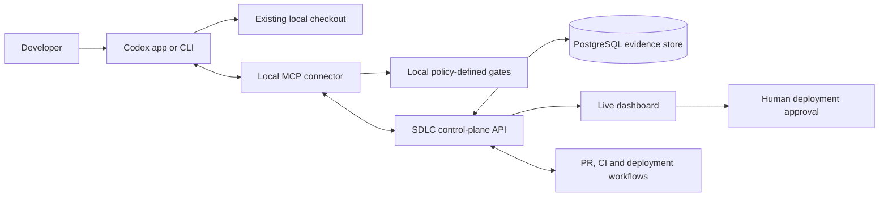

# SDLC Control Plane for Codex

Turn one high-level coding request into a governed, evidence-based software delivery workflow while keeping the developer in the Codex app or CLI they already use.

[Live dashboard](https://sdlc-control-plane.onrender.com/) · [npm connector](https://www.npmjs.com/package/@melson/sdlc-mcp) · [Architecture](HOW-IT-WORKS.md) · [Evaluation protocol](evals/README.md)

## Why this exists

A coding agent can write code, but its statement that a task is “done” is not proof that the change is ready. Developers still have to remember requirements, run the correct checks, inspect failures, request review, follow CI, and control deployment.

This project makes the coding model the **worker** and the SDLC control plane the **decision-maker**. Codex edits the existing local checkout in one visible conversation. The control plane owns the lifecycle state, repository policy, quality gates, evidence, repair loop, delivery status, and human deployment approval.

It does not replace Codex, clone the repository into a hidden worker, require Docker, or ask for a second model login.

## Try it

Requirements: Node.js 20+, Git, Codex desktop or CLI, and a GitHub account.

```powershell
npx -y @melson/sdlc-mcp install
```

The installer opens a short-lived GitHub pairing page, registers the `sdlc` MCP server in Codex, and installs the workflow instructions. Then:

1. Restart Codex.
2. Open an existing Git project.
3. Enter native **Plan mode**.
4. Give the same feature or bug-fix prompt you would normally use.

Example:

> Add an audit-history page with filtering and pagination.

On first use, Codex inventories the project and asks only about uncertain E2E, CI, and optional deployment choices. After the plan is accepted, the same conversation implements the work, runs the governed verification loop, repairs failures, and publishes the verified change. Progress and evidence appear under the same GitHub identity in the [dashboard](https://sdlc-control-plane.onrender.com/).

No harness clone, `.env` file, GitHub personal access token, or shared administrator credential is required for a developer using the hosted instance.

## What happens after the prompt

| Stage               | What the developer sees                                                              | What the control plane enforces                                                                                                             |
| ------------------- | ------------------------------------------------------------------------------------ | ------------------------------------------------------------------------------------------------------------------------------------------- |
| **1. Planning**     | Native Codex Plan mode inspects the request and asks normal clarification questions. | `sdlc_start` records the request, repository identity, starting Git tree, policy version, and bounded company context.                      |
| **2. Requirements** | The accepted plan contains measurable behavior and edge cases.                       | Every requested clause is traced to an acceptance criterion and expected evidence.                                                          |
| **3. Design**       | Codex describes the implementation approach and test strategy.                       | The first verification records a compact plan, requirements, design, test strategy, and risk checkpoint.                                    |
| **4. Coding**       | Codex edits the developer's current local checkout in the same conversation.         | Protected paths, repository identity, and intentional local changes are preserved.                                                          |
| **5. Testing**      | Failures return to Codex for repair.                                                 | Configured build, lint, type, unit, integration, E2E, security, and changed-test gates run until they pass or the attempt limit is reached. |
| **6. Deployment**   | The developer can inspect the PR, CI, and exact release candidate.                   | Only the verified Git tree can be published. Deployment requires explicit dashboard approval and can include health checks and rollback.    |
| **7. Maintenance**  | The dashboard shows release health and lifecycle history.                            | The control plane can monitor the deployment and retain the evidence used to approve it.                                                    |

The agent cannot complete a run through prose. Completion comes from stored checkpoints, the current policy and Git-tree digests, passing required checks, acceptance evidence, required review, and remote CI.

## Architecture



The local MCP process is the bridge between the current Codex conversation, local Git checkout, and hosted control plane. Repository files and local gate execution stay on the developer's machine. The hosted service stores lifecycle state and evidence, serves the dashboard, and coordinates optional GitHub delivery.

A normal ready-repository delivery uses three model-visible calls:

1. `sdlc_start` before implementation
2. `sdlc_verify` after implementation and again only when a repair is needed
3. `sdlc_publish` after the exact verified tree is committed and pushed

`sdlc_review` is added only when repository policy requires native review. `sdlc_status` is reserved for recovery and explicit status requests. Successful logs and background CI polling stay outside model context.

## Core features

- **Native Codex workflow:** one visible Codex task, one local checkout, and native Plan and Review modes.
- **Automatic repository onboarding:** detects the Git remote, base branch, TypeScript or Python stack, package manager, scripts, tests, CI workflows, source/test paths, and deployment clues.
- **Gap-aware SDLC bootstrap:** preserves working infrastructure and asks Codex to create missing scripts, meaningful test layers, CI, and explicitly requested deployment/rollback support.
- **Versioned repository policy:** commands, timeouts, report formats, source/test globs, review rules, protected paths, CI requirements, and release rules are stored outside the prompt.
- **Deterministic verification:** commands use argument arrays and parsed evidence formats such as Vitest, Playwright, JUnit, npm audit, pip-audit, Semgrep, and Gitleaks-compatible results.
- **Repair loop:** failed gates return bounded diagnostics to the same Codex conversation; successful logs remain in the evidence store.
- **Requirement coverage:** each requested clause, exception, boundary case, and compatibility constraint must map to an acceptance criterion and focused evidence.
- **Risk-based review:** risk level, sensitive paths, change breadth, and evidence requirements decide whether native `/review` is mandatory.
- **Verified delivery:** a temporary Git index computes the candidate tree without changing the developer's real index, proving that the pushed commit contains the files that passed.
- **Human-controlled deployment:** the MCP cannot approve a release. Approval is bound to the exact commit, policy version, environment, and workflow.
- **Live dashboard:** shows the seven SDLC phases, current action, gates, artifacts, failures, review, PR/CI state, and deployment decisions.
- **User-scoped project data:** repositories, runs, events, reports, artifacts, and lifecycle mutations are isolated by the authenticated GitHub identity.
- **Paired evaluation:** compares default Codex and governed Codex from the same commit using identical prompts, models, reasoning settings, and hidden checks.

## First-run project setup

Projects often have partial or inconsistent SDLC foundations. The first governed run creates a capability inventory with one of five states: `ready`, `partial`, `missing`, `needs_input`, or `not_applicable`.

After the developer confirms the detected setup, missing capabilities become concrete implementation tasks in the native plan. The controller rejects no-op scripts, placeholder tests, blanket lint/type suppressions, and fake deployment commands. A repository remains in `bootstrapping` until the resulting gates pass. Later runs reuse the verified, versioned policy and avoid repeating discovery.

## Company integration

Company knowledge is more useful as governed context than as text pasted into every prompt. The control plane can store versioned architecture, standards, security policy, testing conventions, domain knowledge, and incident notes. Documents are chunked, ranked with PostgreSQL full-text search, and bounded before they reach the model. Administrator-configured MCP integrations can retrieve context from approved internal tools through explicit tool allowlists.

Each run records the exact policy and context hashes it used. This makes the result reproducible and lets a company enforce the same requirements across developers and repositories.

The intended production topology is one control-plane installation per company. Company knowledge and integrations are installation-scoped; repository and run data are scoped to the authenticated developer within that installation.

## Security and trust boundaries

- GitHub OAuth is used for identity only and requests no repository, organization, or workflow scope.
- Every installed connector receives a separate device credential; the server stores its token identifier as a hash.
- Sessions use HTTP-only cookies, OAuth state validation, CSRF protection, origin checks, role checks, and redacted request logging.
- A user cannot list, read, mutate, publish, download reports from, or fetch artifacts for another user's repository or run.
- Local repository work uses the developer's existing Git checkout and credential manager.
- The model does not choose or rewrite verification commands during a run; versioned repository policy does.
- GitHub and deployment credentials do not enter MCP tool results.
- Deployment approval is not exposed as an MCP tool.

## Key engineering decisions and challenges

### Keep the native developer environment

The first design used isolated workers and separate agent sessions. That added setup friction, repeated repository reading, hid progress, and increased usage. The final design integrates with the existing Codex app or CLI session and local checkout.

### Separate model judgment from completion evidence

Models are useful for requirements, design, implementation, and repair. They should not be the authority deciding whether their own work passed. The controller therefore owns state transitions and accepts completion only from machine-readable evidence tied to the candidate Git tree.

### Stay repository-agnostic

The runtime contains no benchmark repository names, task IDs, prompts, or hidden-check logic. First-run discovery uses project metadata and file structure. Repository-specific behavior lives in the generated, reviewable policy.

### Control model usage without making false savings claims

MCP calls add context overhead. The implementation reduces avoidable cost by using a compact three-call path, keeping successful logs out of model context, running independent checks concurrently, reusing safe setup work, and skipping extra review turns when policy permits. Material token reduction would require an owned agent harness that controls context selection and model scheduling.

### Preserve native Plan and Review modes

Codex does not expose a tool that lets an MCP server switch client modes or type slash commands. The developer therefore enters Plan mode at the start and types `/review` only when policy requests it. This keeps both interactions visible and uses Codex's optimized native workflows.

### Make a public demo safe for multiple users

GitHub login, role-based access, per-device pairing, CSRF protection, and user-scoped repository/run authorization were added so public testers do not share project records or evidence.

## Evaluation results

The repository includes the evaluator because the existence of a control loop does not prove that it improves a strong coding agent.

The latest five-task paired pilot produced a **5/5 quality tie** between default Codex and the governed workflow. The optimized harness used **1.14× total tokens** and **1.21× wall time** relative to baseline, down from 1.44× and 1.78× in the first implementation. It also caught and repaired one compile defect automatically. These results validate the workflow mechanics and overhead reductions, but they do **not** prove a quality improvement or token saving.

A separate SWE-bench-Live pilot is also published, including its failed hidden case and measured cost. Negative results are kept in the repository rather than removed from the project narrative.

The next meaningful evaluation is 10–20 blinded historical company tasks with architecture and incident context plus held-out regression and security checks. See [the evaluation protocol](evals/README.md), [optimized pilot](evals/results/optimized-pilot-2026-09-20.md), and [SWE-bench-Live pilot](evals/results/2026-09-20-swe-bench-live-pilot.md).

## Current scope

- The shipped connector targets Codex. The control-plane contracts can support other coding agents, but no Claude adapter is included yet.
- Plan-mode selection and `/review` remain explicit developer actions because the Codex client owns those controls.
- Quality is only as strong as the repository's configured tests, scanners, and policies.
- Deployment requires a real target, workflow, health endpoint, and explicit approval; it is disabled by default.
- The public Render service and free PostgreSQL plan are for demonstration, not production company data or availability.
- Production multi-company SaaS would require organization-level tenancy, managed secrets, backups, retention policy, observability, and stronger availability controls. The current deployment model is one installation per company.

## Run locally

```powershell
npm install
npm run dev
```

Run the complete repository checks:

```powershell
npm run check
npm run test:e2e
```

For the local dashboard and production build on Windows:

```powershell
.\start.ps1
```

Application owners configure one GitHub OAuth App with:

```dotenv
GITHUB_CLIENT_ID=application_client_id
GITHUB_CLIENT_SECRET=application_client_secret
GITHUB_ALLOWED_USERS=comma_separated_github_logins_or_*
GITHUB_ADMIN_USERS=comma_separated_admin_logins
```

End users never create an OAuth application. For a no-cost hosted demonstration, follow the [Render deployment guide](docs/render-deployment.md).

## Repository map

| Path                                      | Responsibility                                                             |
| ----------------------------------------- | -------------------------------------------------------------------------- |
| `packages/sdlc-mcp`                       | Published installer and local Codex connector                              |
| `apps/server/src/chat-mcp.ts`             | Five tools exposed to the current Codex conversation                       |
| `apps/server/src/repository-discovery.ts` | First-run stack, command, test, CI, and deployment discovery               |
| `apps/server/src/workspace.ts`            | Local Git inspection, candidate digest, and safe command execution         |
| `apps/server/src/run-service.ts`          | Durable lifecycle, repair, review, delivery, and maintenance state machine |
| `apps/server/src/gates.ts`                | Evidence parsing and completion rules                                      |
| `apps/server/src/api.ts`                  | OAuth, pairing, authorization, tenant boundary, and dashboard API          |
| `apps/server/src/github.ts`               | Pull requests, CI, deployment, rollback, and health workflows              |
| `apps/web/src/main.tsx`                   | Setup and live execution dashboard                                         |
| `shared/types.ts`                         | Validated lifecycle and policy contracts                                   |
| `evals`                                   | Paired benchmark runner, protocol, and published results                   |

Read [HOW-IT-WORKS.md](HOW-IT-WORKS.md) for the detailed state machine and [docs/codex-chat.md](docs/codex-chat.md) for the developer workflow.
